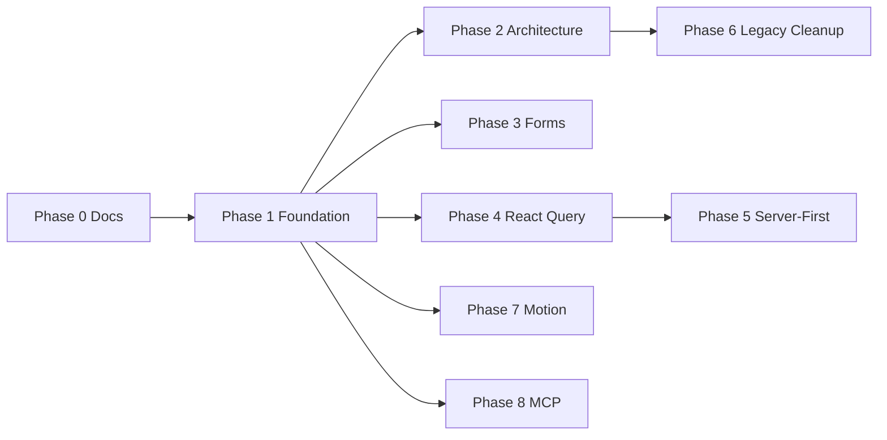

# B3 Academy — Cursor Rules & Skills Implementation Plan

> **Purpose:** Bring the codebase in line with every rule and skill under `.cursor/`, **excluding i18n/translation** for now (`i18n.md`, `rules/i18n.mdc`, and i18n sections of `.cursorrules`).
>
> **Companion doc:** Business alignment work stays in `DETAILED_FRONTEND_BUSINESS_ALIGNMENT_IMPLEMENTATION_PLAN.md`. This plan covers **engineering conventions only**.

---

## 0. How To Read This Document

| Section | Contents |
| ------- | -------- |
| **1. Source inventory** | Every `.cursor/` artifact mapped to implementation work |
| **2. Current-state audit** | Verified gaps against the repo today |
| **3. Doc reconciliation** | Resolve contradictions before large refactors |
| **4. Phases 1–8** | Ordered implementation roadmap with tasks and acceptance criteria |
| **5. Rollout strategy** | How to apply changes without blocking feature work |
| **6. Validation checklist** | Definition of done per phase |

### Priority / complexity scales

- **Priority:** Critical · High · Medium · Low
- **Complexity:** Small (≤1 day) · Medium (2–4 days) · Large (1–2+ weeks)

### Explicitly out of scope (this plan)

- i18n hardcoding cleanup, `next-intl` migration, `messages/*.json`, RTL logical-property sweep
- Backend/Laravel API work (React Query layer should be ready for it, but wiring real endpoints is separate)
- Business-requirement gaps from the business alignment plan

---

## 1. Source Inventory (`.cursor/` → work items)

| File | Type | Implementation theme |
| ---- | ---- | -------------------- |
| `.cursorrules` | Agent rules | Stack deps, workflow, forms/toasts, loading states, dashboard image upload |
| `rules/architecture.mdc` | Always-on rule | Route/feature/layout boundaries, coding style, lint gate |
| `architecture.md` | Skill / standard | Feature folders, naming, TS strictness, schema discovery for services |
| `components.md` | Skill / standard | UI hierarchy, Radix a11y, Lucide sizing, 200-line decomposition |
| `react-query.md` | Skill / standard | Global cache errors, query-key factories per feature |
| `server-first.md` | Skill / standard | RSC default, prefetch + `HydrationBoundary`, services in `services/` |
| `framer-motion-stagger.md` | Skill | Viewport Y-axis stagger variants (`motion` package) |
| `mcp.json` | Tooling | shadcn + next-devtools MCP servers for agent/dev workflow |
| ~~`i18n.md`~~ | — | **Deferred** |
| ~~`rules/i18n.mdc`~~ | — | **Deferred** |

---

## 2. Current-State Audit (verified 2026-06-22)

### 2.1 What already aligns

| Area | Evidence |
| ---- | -------- |
| App Router routes | `src/app/(site)`, `(account)`, `(admin)`, etc. |
| Feature modules | ~25 modules under `src/features/*` with `components/`, `services/`, `types/` |
| Regular function components | Common pattern across feature pages |
| `motion` usage | `motion/react` in reader, consultation, health assessment, etc. |
| Logical spacing in places | e.g. `ps-*`, `end-*` in `components/UI.tsx` |
| Confirm dialog shell | `src/components/feedback/confirm-dialog.tsx` (needs loading-state upgrade) |
| Field error primitive | `FormFieldError` in `src/components/feedback/feedback.tsx` |
| MCP config present | `.cursor/mcp.json` defines shadcn + next-devtools |

### 2.2 Gaps (must close)

| Rule source | Gap | Severity |
| ----------- | --- | -------- |
| `.cursorrules` stack | `@tanstack/react-query`, `react-hook-form`, `zod`, `sonner` **not in** `package.json` | Critical |
| `.cursorrules` forms | No global toast layer; `FormStatusMessage` exists but inline banners conflict with “toasts always” | High |
| `.cursorrules` forms | No consistent `isPending` / disabled + spinner on mutation buttons | High |
| `.cursorrules` uploads | No `@/components/ui/image-upload`; raw `accept="image/*"` in profile + chat | Medium |
| `react-query.md` | No `QueryClient`, `QueryCache`, `MutationCache`, or `query-keys.ts` anywhere | Critical |
| `server-first.md` | No `prefetchQuery` / `HydrationBoundary` / `dehydrate` usage | High |
| `components.md` | No `components/ui/` primitive layer; legacy root `components/` still referenced | High |
| `components.md` | No Radix UI primitives | Medium |
| `components.md` | Several components **>200 lines** (e.g. `course-player.tsx` ~886, `checkout-page.tsx` ~778) | Medium |
| `architecture.md` | Arrow-function components in places; mixed export styles; not all services follow check-before-type | Medium |
| `architecture.md` vs `rules/architecture.mdc` | Docs disagree on `features/` vs `src/features/` | Critical (docs) |
| `framer-motion-stagger.md` | Shared stagger variants not extracted; `whileInView` pattern not standardized | Low |
| `mcp.json` | MCP servers configured but `components/ui` not bootstrapped via shadcn | Medium |

### 2.3 Legacy drift to retire

- Root-level `components/` (`Layout.tsx`, `UI.tsx`, `AIChatWidget.tsx`, etc.) parallel `src/features/*`
- Root-level React contexts (`LanguageContext`, `BlogContext`, …) imported from `src/app/providers.tsx` via `../../`
- `.cursorrules` references `AGENTS.md` — file **does not exist** in repo
- `.cursorrules` says root `features/`; codebase and `architecture.md` use `src/features/`

---

## 3. Phase 0 — Doc Reconciliation (do first)

**Goal:** One canonical path so agents and developers stop conflicting.

| Task | Action | Priority |
| ---- | ------ | -------- |
| 0.1 | Create `AGENTS.md` at repo root summarizing: actual paths (`src/app`, `src/features`, `src/components`), stack, lint command, and pointer to this plan | Critical |
| 0.2 | Update `.cursor/rules/architecture.mdc` and `.cursor/.cursorrules` to say **`src/features/`** (match reality) OR schedule a physical move to root `features/` in a dedicated migration — **pick one, document it in `AGENTS.md`** | Critical |
| 0.3 | Add banner at top of `.cursor/architecture.md` noting it defers to `AGENTS.md` for directory paths | Low |
| 0.4 | Mark i18n sections in `.cursorrules` as deferred; keep `rules/i18n.mdc` but add “not in current rollout” note in `AGENTS.md` | Low |

**Acceptance:** A new contributor reads only `AGENTS.md` + `.cursor/rules/architecture.mdc` and gets correct paths.

---

## 4. Phase 1 — Foundation Stack & Shared Primitives

**Covers:** `.cursorrules` (stack), `components.md` (hierarchy), `mcp.json` (shadcn bootstrap)

### 4.1 Dependencies

```bash
npm install @tanstack/react-query react-hook-form zod @hookform/resolvers sonner
npm install @radix-ui/react-dialog @radix-ui/react-dropdown-menu @radix-ui/react-tabs @radix-ui/react-slot
```

| Package | Why |
| ------- | --- |
| `@tanstack/react-query` | `react-query.md`, `server-first.md` |
| `react-hook-form` + `zod` | `.cursorrules` forms stack |
| `sonner` | Toast standard in `.cursorrules` |
| Radix packages | `components.md` a11y |

### 4.2 Bootstrap `src/components/ui/`

Use shadcn MCP (`.cursor/mcp.json`) or CLI to add minimal set:

| Primitive | Used for |
| --------- | -------- |
| `button` | Loading/disabled mutations |
| `input`, `label`, `textarea` | Forms |
| `dialog` | Replace ad-hoc modals; upgrade `confirm-dialog` |
| `dropdown-menu`, `tabs` | Navigation/settings patterns |
| `sonner` toaster | Global feedback |

Configure `components.json` with aliases: `@/components/ui`, `@/lib`.

### 4.3 Feedback layer

Create `src/lib/feedback/` (or `src/components/feedback/`):

| Export | Behavior |
| ------ | -------- |
| `toastSuccess`, `toastError`, `toastInfo` | Thin wrappers over Sonner |
| `ErrorAlert` | Maps API/unknown errors → `toastError` |
| `SuccessToast` | Maps save success → `toastSuccess` |

Deprecate `FormStatusMessage` for **action** feedback (keep only for non-toast inline states if needed).

### 4.4 Image upload primitive

Create `src/components/ui/image-upload.tsx`:

- Controlled value + `onChange`
- Preview, remove, size hint
- Uses hidden file input internally (single abstraction point)
- Replace raw inputs in:
  - `src/features/account/components/account-sections/profile-page.tsx`
  - `src/features/consultations/components/chat-consultation.tsx`
  - All admin `*-edit-page.tsx` forms that accept images

**Acceptance:** `npm run lint` passes; Sonner renders from root layout; no new raw `accept="image/*"` outside `image-upload`.

---

## 5. Phase 2 — Architecture & TypeScript Standards

**Covers:** `rules/architecture.mdc`, `architecture.md`

### 5.1 Enforce feature boundaries

| Task | Detail |
| ---- | ------ |
| Route thinness | Each `src/app/**/page.tsx` should import one feature page component; no business logic in routes |
| Service location | All data access stays in `src/features/[name]/services/` as `export async function` |
| Public exports | Add `index.ts` only where cross-feature imports exist today |

### 5.2 Naming & syntax (incremental, file-touch policy)

When editing a file, align to:

| Rule | Target |
| ---- | ------ |
| Filenames | `kebab-case.tsx` |
| Components | `export default function PascalCase()` |
| Services | `export async function verbNoun()` — no arrow exports |
| `any` | Remove on touch (grep shows very few) |

Do **not** mass-rename entire tree in one PR; enforce on changed files via ESLint rules (optional follow-up).

### 5.3 Schema discovery protocol (`architecture.md` §4)

Before typing a new API service:

1. Document endpoint in service file header comment
2. Capture sample JSON (mock fixture until Laravel exists)
3. Generate types in `types/` from sample, not assumptions
4. Add vitest contract test comparing parser to fixture

Apply first to features closest to backend handoff: `auth`, `account`, `checkout`, `care`.

**Acceptance:** New services follow protocol; no new `any`; routes remain thin.

---

## 6. Phase 3 — Forms, Loading States & Toasts

**Covers:** `.cursorrules` Forms section, `components.md` container/presentational split

### 6.1 Form hook pattern

Create `src/lib/forms/use-app-form.ts` (thin wrapper):

- `react-hook-form` + `zodResolver`
- Field errors → `FormFieldError` under each input
- Submit errors → `ErrorAlert` / toast only

### 6.2 Mutation button pattern

Create `src/components/ui/submit-button.tsx`:

- Props: `isPending`, `pendingLabel`, `label`
- Disabled + `LoaderCircle` while pending

Apply to high-traffic forms first:

| Feature | Files |
| ------- | ----- |
| Auth | `auth-page.tsx` |
| Account | `profile-page.tsx`, `password-page.tsx` |
| Checkout | `checkout-page.tsx` |
| Admin | `admin-form-fields.tsx` + edit pages |
| Community | `podcast-request-form.tsx`, cooperation flows |

### 6.3 Confirm dialog loading

Extend `confirm-dialog.tsx`:

- `isConfirming` prop
- Disable confirm button + spinner label during delete/save

### 6.4 Ban inline action alerts

| Remove / replace | With |
| ---------------- | ---- |
| Inline success/error banners after save | `SuccessToast` / `ErrorAlert` |
| Browser `alert()` | Toast (none found today — keep guard in ESLint `no-alert`) |

**Acceptance:** Every backend-triggering button shows loading; field errors under inputs; API errors only in toasts.

---

## 7. Phase 4 — React Query Infrastructure

**Covers:** `react-query.md`

### 7.1 Global client

Add `src/lib/query/query-client.ts`:

```typescript
// QueryCache + MutationCache → toastError for global failures
// Mutations toast success by default; opt-out per mutation
```

Wire in `src/app/providers.tsx` via `QueryClientProvider`.

### 7.2 Query key factories

For each feature that fetches data, add `query-keys.ts` at feature root.

**Wave 1 (read-heavy catalog features):**

- `books`, `courses`, `podcasts`, `trips`, `library`, `community`, `search`

**Wave 2 (account/care):**

- `account`, `care`, `consultations`, `checkout`, `subscriptions`

Template:

```typescript
export const bookKeys = {
  all: ['books'] as const,
  lists: () => [...bookKeys.all, 'list'] as const,
  detail: (id: string) => [...bookKeys.all, 'detail', id] as const,
};
```

### 7.3 Hooks per feature

Replace direct service calls in client components with:

- `useQuery` for reads
- `useMutation` for writes (invalidates via key factory)

**Rule:** No `toast.error()` inside components/hooks — only global caches + inline field UI.

### 7.4 DevTools (optional)

`@tanstack/react-query-devtools` in development only.

**Acceptance:** Zero inline string query keys; global errors toast; features have `query-keys.ts`.

---

## 8. Phase 5 — Server-First & Hydration

**Covers:** `server-first.md`

### 8.1 Default to Server Components

Audit `src/app/**/page.tsx` marked `'use client'`:

| Keep client | Move logic to server + hydrate |
| ----------- | ------------------------------ |
| Event handlers, hooks, browser APIs | Static/initial data fetch |

Target first: catalog pages (`books`, `courses`, `trips`, `encyclopedia` list/detail).

### 8.2 Hydration pattern

For each migrated page:

1. Server `page.tsx` creates `QueryClient`, `prefetchQuery` via service
2. Wrap feature client subtree in `HydrationBoundary state={dehydrate(qc)}`
3. Client feature component uses same `query-keys` + `useQuery` (instant cache hit)

Add `src/lib/query/get-query-client.ts` helper for RSC-safe client creation.

### 8.3 Services stay isomorphic

Services in `services/` must be callable from Server Components (no `window` / `localStorage` without guard).

Split browser-only persistence helpers (already partially done in `*-storage.service.ts`).

**Acceptance:** At least 4 catalog routes use prefetch + hydration; client pages shrink.

---

## 9. Phase 6 — Component Quality & Legacy Cleanup

**Covers:** `components.md`, `rules/architecture.mdc` (shared locations)

### 9.1 UI hierarchy migration

| From | To |
| ---- | -- |
| Root `components/UI.tsx`, `Graphics.tsx` | `src/components/public/` or feature-owned |
| Root `components/Layout.tsx` | `src/features/navigation/` (merge with `site-layout.tsx`) |
| Duplicate widgets (`components/AIChatWidget.tsx`) | Single `src/features/ai-assistant/` entry |

### 9.2 Decompose >200-line components

Priority splits:

| File | Suggested extractions |
| ---- | --------------------- |
| `course-player.tsx` | `course-sidebar`, `lesson-panel`, `progress-header` |
| `checkout-page.tsx` | `checkout-summary`, `payment-step`, `review-step` |
| `health-assessment-page.tsx` | step components per section |
| `clinic-booking-flow.tsx` | step components (slot, details, confirm) |

### 9.3 Container / presentational

For each split: data hook in `hooks/use-*.ts`, presentational child components receive props only.

### 9.4 Accessibility pass (on touch)

- Prefer Radix `Dialog` over hand-rolled `confirm-dialog` backdrop logic
- Lucide: use `size={n}` prop consistently
- Focus trap + Escape already started in confirm dialog — align with Radix

**Acceptance:** No imports from root `components/` in `src/`; top 5 oversized files split.

---

## 10. Phase 7 — Motion Stagger Skill

**Covers:** `framer-motion-stagger.md` (use existing `motion` package, not `framer-motion`)

### 10.1 Shared variants module

Create `src/lib/motion/stagger.ts`:

- Export `staggerContainerVariants` and `staggerItemVariants` exactly as specified in the skill doc
- Use `motion` from `motion/react`

### 10.2 Reusable wrappers

| Component | Purpose |
| --------- | ------- |
| `StaggerList` | Parent `motion.div` with `whileInView`, `viewport={{ once: true, amount: 0.15 }}` |
| `StaggerItem` | Child with `staggerItemVariants` |

### 10.3 Apply to list-heavy pages

| Page | Lists to animate |
| ---- | ---------------- |
| `home-page.tsx` | Hero cards, featured rows |
| `book-catalog.tsx`, `course-catalog.tsx` | Product grids |
| `blogs-page.tsx`, `researches-page.tsx`, `theories-page.tsx` | Content cards |
| `trips-page.tsx`, `podcast-library.tsx` | Catalog grids |

### 10.4 Guardrails

- Y-axis only (no X translation)
- Respect `prefers-reduced-motion` — skip animation when set

**Acceptance:** Shared variants file exists; ≥6 list views use `StaggerList`; reduced-motion honored.

---

## 11. Phase 8 — MCP & Agent Tooling

**Covers:** `mcp.json`

| Task | Detail |
| ---- | ------ |
| 8.1 | Verify shadcn MCP works against bootstrapped `components.json` |
| 8.2 | Verify next-devtools MCP against `next dev` |
| 8.3 | Document in `AGENTS.md` how agents should use MCP for UI scaffolding |
| 8.4 | Add ESLint rule scripts to `package.json` if missing: `"lint:fix": "eslint . --fix"` |

**Acceptance:** Both MCP servers start; `AGENTS.md` documents agent workflow.

---

## 12. Rollout Strategy



### PR slicing (recommended)

| PR | Phases | Risk |
| -- | ------ | ---- |
| 1 | 0 + 1.1–1.3 | Low |
| 2 | 1.4 + 3 | Medium |
| 3 | 4.1–4.2 | Medium |
| 4 | 4.3 wave 1 | Medium |
| 5 | 5 (2–4 routes) | Medium |
| 6 | 6.1 legacy imports | High — do incrementally |
| 7 | 7 motion | Low |
| 8 | 4.3 wave 2 + 5 expansion | Medium |

### File-touch policy

When fixing a bug or adding a feature **after Phase 1 lands**:

1. Use toast + loading button patterns
2. Use `query-keys` if adding fetch
3. Split file if it crosses 200 lines
4. Run `npm run lint`

---

## 13. Validation Checklist

| Phase | Definition of done |
| ----- | ------------------- |
| 0 | `AGENTS.md` exists; path convention single-sourced |
| 1 | Deps installed; Sonner in layout; `image-upload` used in admin/profile |
| 2 | New services follow schema discovery; routes thin |
| 3 | Auth + checkout + one admin form use `SubmitButton` + toasts |
| 4 | `QueryClientProvider` live; ≥8 features have `query-keys.ts` |
| 5 | ≥4 pages prefetch + hydrate |
| 6 | Zero `from '../../components/` imports; top 5 large files split |
| 7 | `stagger.ts` + 6 list pages animated |
| 8 | MCP verified and documented |

### Commands (every PR)

```bash
npm run lint
npm run typecheck
npm test
```

---

## 14. Deferred — i18n (separate plan)

When translation work starts, use `.cursor/i18n.md` and `rules/i18n.mdc`:

- Audit hardcoded strings per feature
- Extend existing `LanguageContext` / `translateMessage` pattern (not `next-intl` unless deliberately migrated)
- RTL logical-property sweep on new `components/ui`
- `formatCurrency` / `date-fns` locale helpers

**Do not start i18n until Phases 1 and 3 are stable** — toast and form messages need the feedback layer first.

---

## 15. Quick Reference — Rule → File Mapping

| Need to… | Read |
| -------- | ---- |
| Know repo layout | `AGENTS.md`, `rules/architecture.mdc` |
| Add a form | Phase 3, `.cursorrules` Forms |
| Add data fetching | Phase 4–5, `react-query.md`, `server-first.md` |
| Add list animation | Phase 7, `framer-motion-stagger.md` |
| Add shared button/dialog | Phase 1, `components.md` |
| Scaffold UI with agent | Phase 8, `mcp.json` |

---

*Generated from `.cursor/` inventory. Excludes i18n per request. Revisit after `AGENTS.md` is created and path convention is finalized.*
